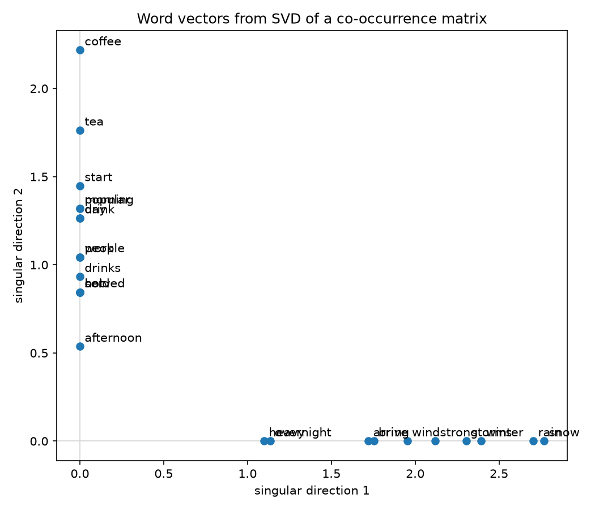

# Singular Value Decomposition (SVD)

!!! info "Where this shows up"
    PCA, low-rank matrix approximation, pseudo-inverses / least squares,
    recommender systems (matrix factorization), and as the numerical
    backbone under a lot of "compress this big matrix" tricks in ML papers.

## Definition

Any real matrix $A \in \mathbb{R}^{m \times n}$ can be factored as

$$
A = U \Sigma V^\top
$$

- $U \in \mathbb{R}^{m \times m}$ and $V \in \mathbb{R}^{n \times n}$ are
  orthogonal ($U^\top U = I$, $V^\top V = I$).
- $\Sigma \in \mathbb{R}^{m \times n}$ is diagonal (in the rectangular
  sense — zero off the main diagonal) with non-negative entries
  $\sigma_1 \geq \sigma_2 \geq \dots \geq \sigma_r \geq 0$, the **singular
  values**, where $r = \mathrm{rank}(A)$.

Columns of $U$ are the **left singular vectors**, columns of $V$ the
**right singular vectors**.

## Where U, V, Σ come from

- The columns of $V$ are eigenvectors of $A^\top A$; the columns of $U$
  are eigenvectors of $A A^\top$.
- The singular values are the square roots of the (shared, non-negative)
  eigenvalues of $A^\top A$ and $A A^\top$: $\sigma_i = \sqrt{\lambda_i}$.
- So SVD generalizes eigendecomposition to non-square, non-symmetric
  matrices — every matrix has an SVD, but not every matrix has an
  eigendecomposition.

## Geometric picture

$A$ maps the unit sphere in $\mathbb{R}^n$ to an ellipsoid in
$\mathbb{R}^m$: $V^\top$ rotates the input, $\Sigma$ stretches each axis
by $\sigma_i$, and $U$ rotates the result into place. The $\sigma_i$ are
literally the lengths of the ellipsoid's semi-axes.

## Low-rank approximation (Eckart–Young)

Writing $A = \sum_{i=1}^r \sigma_i u_i v_i^\top$ (sum of rank-1 terms,
largest $\sigma_i$ first), the best rank-$k$ approximation of $A$ in both
Frobenius and spectral norm is just truncating the sum:

$$
A_k = \sum_{i=1}^k \sigma_i u_i v_i^\top
$$

This is the "why" behind SVD-based compression: keep the top-$k$ singular
triples, drop the rest, and you have the closest possible rank-$k$
matrix — with error $\|A - A_k\|_F = \sqrt{\sum_{i=k+1}^r \sigma_i^2}$.

## Relation to PCA

For a centered data matrix $X$ (rows = samples, columns = features), PCA's
principal components are exactly the right singular vectors $V$ of $X$,
and the projected scores are $U \Sigma$. In practice, SVD on $X$ directly
is more numerically stable than eigendecomposing the covariance matrix
$X^\top X$.

## Pseudo-inverse

The Moore-Penrose pseudo-inverse falls out directly:

$$
A^+ = V \Sigma^+ U^\top
$$

where $\Sigma^+$ inverts the non-zero singular values in place and
transposes the shape. This gives the least-squares solution to
$Ax = b$ even when $A$ isn't square or invertible.

```python
import numpy as np

A = np.random.randn(50, 20)
U, s, Vt = np.linalg.svd(A, full_matrices=False)

k = 5
A_k = U[:, :k] @ np.diag(s[:k]) @ Vt[:k, :]  # best rank-k approximation
```

## Example: word vectors from a co-occurrence matrix

A classic "count-based" way to turn words into vectors: count how often
words appear near each other across a corpus, then run SVD on the
resulting matrix and keep the top singular directions as word vectors.
Related words end up with similar vectors because they tend to appear in
similar contexts, not because they ever appear next to each other
directly.

### Building the co-occurrence matrix

Fix a vocabulary of $n$ words and a window size $w$. For each occurrence
of word $i$ in the corpus, count every other word $j$ that falls within
$w$ tokens of it and increment $M_{ij}$. This gives a symmetric
$n \times n$ matrix $M$ where $M_{ij}$ is roughly "how often $i$ and $j$
occur near each other" — a much denser, cheaper-to-build signal than
raw text, but one that already captures a lot of distributional
structure ("you shall know a word by the company it keeps").

### From counts to vectors: truncated SVD

$M$ is symmetric, so its SVD coincides with its eigendecomposition:
$M = U \Sigma U^\top$. Row $i$ of $M$ is the count vector for word $i$
over the full vocabulary — sparse, high-dimensional, and mostly noise.
Taking the truncated SVD

$$
M \approx U_k \Sigma_k U_k^\top, \qquad
\text{word vector for } i = (U_k \Sigma_k)_{i,:} \in \mathbb{R}^k
$$

keeps only the $k$ directions of $M$ that explain the most co-occurrence
variance (same low-rank approximation idea as above), and rows of
$U_k \Sigma_k$ become dense $k$-dimensional word vectors. Words with
similar rows in $M$ — i.e. similar co-occurrence patterns — land close
together in this reduced space, even if they never co-occur with each
other.

### Worked example

[`code/svd_word_vectors.py`](https://github.com/ahsank/MachineLearning/blob/master/code/svd_word_vectors.py)
hardcodes five short documents split across two loose topics (beverages,
winter weather), builds their word-word co-occurrence matrix with a
window of 3 tokens, and reduces it to 2D with truncated SVD ($k=2$):

```python
def build_co_occurrence_matrix(tokenized_docs, vocab, window_size):
    index = {word: i for i, word in enumerate(vocab)}
    matrix = np.zeros((len(vocab), len(vocab)))
    for doc in tokenized_docs:
        for center_pos, center_word in enumerate(doc):
            start = max(0, center_pos - window_size)
            end = min(len(doc), center_pos + window_size + 1)
            for context_pos in range(start, end):
                if context_pos != center_pos:
                    matrix[index[center_word], index[doc[context_pos]]] += 1
    return matrix


def word_vectors_via_svd(matrix, k=2):
    u, s, _ = np.linalg.svd(matrix, full_matrices=False)
    return u[:, :k] * s[:k]  # rows are k-dim word vectors
```

Plotting the resulting 2D vectors shows the two topics falling cleanly
onto separate axes, since none of the beverage words ever co-occur with
any weather word:



`coffee` and `tea` sit furthest out along the beverage axis because they
each appear in two of the three beverage documents, making them the
best-connected ("hub") words in that block — the same reasoning puts
`rain` and `snow` furthest out on the weather axis. See
[`code/README.md`](https://github.com/ahsank/MachineLearning/blob/master/code/README.md)
for how to run the script yourself.
