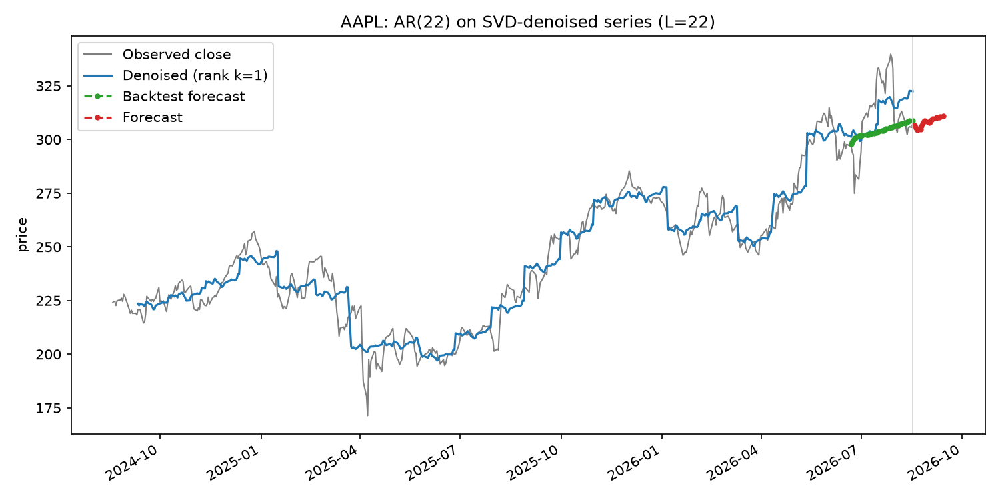
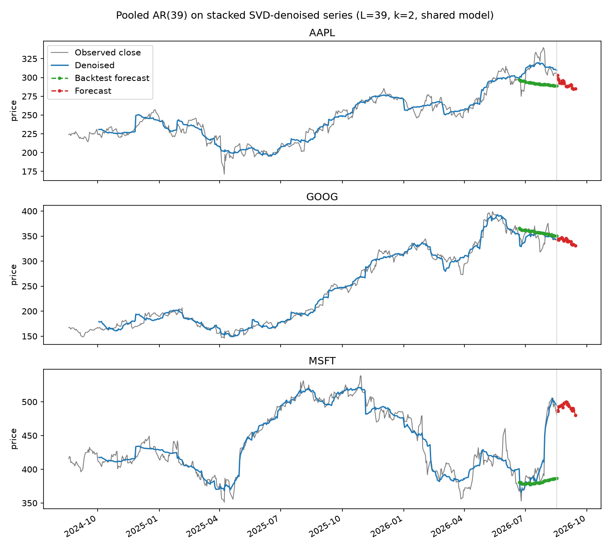

# SVD-Denoised Autoregressive Forecasting

!!! info "Related to"
    This grew out of experimenting with the Page-matrix SVD technique in
    [Multivariate Singular Spectrum Analysis (Page Matrix SVD)](../papers/mssa-page-matrix-svd.md).
    It isn't from that paper — it's a simpler practical variant — but
    reuses its denoising step.

## The idea

The paper's forecasting model is fit on non-overlapping pages: with page
length $L$, a series of length $T$ gives only $T/L$ training examples,
each contributing one (features, target) pair. That's a small training
set, and it ties the regression window to $L$ (chosen for denoising, not
forecasting).

This variant separates the two concerns:

1. **Denoise** the series with the same Page-matrix SVD / Hard Singular
   Value Thresholding as before — unchanged.
2. **Fit a plain autoregression** on the *denoised* series: predict
   $v(t)$ from $v(t-w), \dots, v(t-1)$ by ordinary least squares, using
   every *overlapping* window of length $w$ as a training example. For
   $T=500$ and $w \approx 20$, that's roughly 480 overlapping training
   examples instead of ~20 non-overlapping pages — much more data for the
   same regression, and $w$ is now a free parameter independent of the
   denoising window $L$.

**Denoised for fitting, raw for forecasting.** The AR coefficients are
fit on the denoised series, so they benefit from the same noise reduction
the paper's model gets. But the actual forecast is seeded with *raw*
recent prices, not denoised ones: the last few points of any Page-matrix
reconstruction are the least reliable (there's no future data yet to
smooth them with — visible as the ragged right edge of the blue line in
every plot in these notes), so denoised values there would hand the model
inputs unlike anything it saw during training. This split — fit on
smoothed history, forecast from the raw, most-recent boundary — is the
same thing classical (single-series) SSA forecasting has always done; it
isn't a shortcut specific to this variant.

```python
def fit_ar_model(denoised, window):
    windows = np.lib.stride_tricks.sliding_window_view(denoised, window + 1)
    features, targets = windows[:, :-1], windows[:, -1]
    beta, *_ = np.linalg.lstsq(features, targets, rcond=None)
    return beta

def forecast(x, beta, horizon):  # x is raw, not denoised
    window_size = len(beta)
    history = list(x[-window_size:])
    predictions = []
    for _ in range(horizon):
        pred = np.dot(history[-window_size:], beta)
        predictions.append(pred)
        history.append(pred)
    return np.array(predictions)
```

The multi-stock version keeps the paper's stacked Page matrix for
*denoising* (so each stock's smoothing still benefits from shared
structure across stocks), but pools overlapping windows from every
(normalized) stock's denoised series into one shared regression, instead
of stacking non-overlapping pages.

Code: [`svd_denoised_ar_stock_forecast.py`](https://github.com/ahsank/MachineLearning/blob/master/code/svd_denoised_ar_stock_forecast.py) ·
[`svd_denoised_ar_multi_stock_forecast.py`](https://github.com/ahsank/MachineLearning/blob/master/code/svd_denoised_ar_multi_stock_forecast.py) ·
[`code/README.md`](https://github.com/ahsank/MachineLearning/blob/master/code/README.md)
for how to run either script, including the same `--backtest-days` option
used below.

## Output: single stock



Backtesting AAPL (40 held-out trading days) gives RMSE 17.0 here, versus
19.2 for the [paper's page-wise regression](../papers/mssa-page-matrix-svd.md#worked-example-single-stock)
on the same data and window — a modest improvement, consistent with
having roughly 20x more (overlapping) training examples to fit the same
number of coefficients from. The forecast itself is also visibly more
conservative: it oscillates near the last price rather than extrapolating
a steep trend, likely because pooling many overlapping windows averages
out more of the short-term drift that a handful of non-overlapping pages
can't.

## Output: multiple stocks



Same story for AAPL and GOOG. MSFT is the interesting case: the held-out
40 days include a sharp earnings-driven jump, and the backtest forecast
(green) stays essentially flat while the actual price (gray) jumps well
above it. **This isn't a bug or a tuning miss** — a model built from a
couple of low-rank trend directions and a linear autoregression has no
mechanism to anticipate a discrete news event; it can only extrapolate
the smooth structure it was shown. It's included here deliberately, as a
concrete reminder of what this whole family of techniques (the paper's
version too) can't do, not just what it can.
