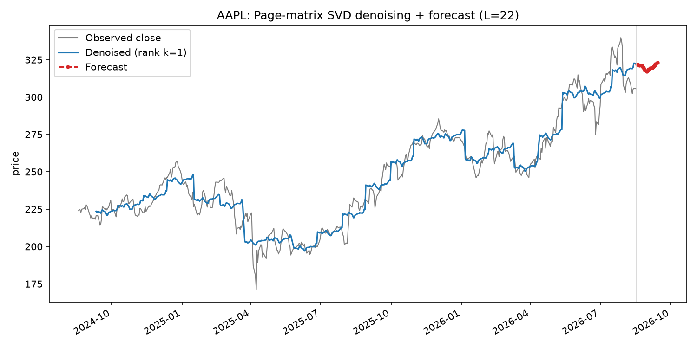
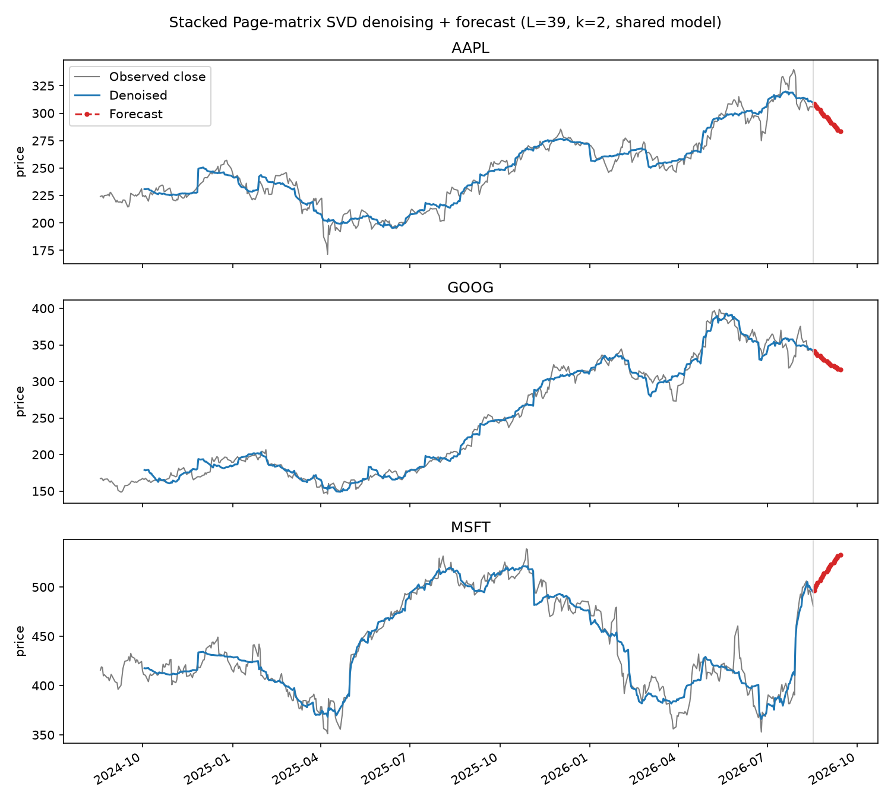

# On Multivariate Singular Spectrum Analysis (Agarwal, Alomar & Shah, 2020)

!!! info "Reference"
    Agarwal, A., Alomar, A., Shah, D. *On Multivariate Singular Spectrum
    Analysis: Tensor and Matrix Variants*.
    [arXiv:2006.13448](https://arxiv.org/abs/2006.13448) ·
    [reference implementation (mSSA)](https://github.com/AbdullahO/mSSA)

The paper covers a lot of ground (a tensor variant tSSA, variance
estimation, a "Hankel calculus" expressiveness theory, finite-sample
error bounds). This note only covers the piece that's directly useful in
practice and reusable outside the paper's theory: **building a Page
matrix from a time series and using SVD on it for denoising and
forecasting** — the matrix-based mSSA algorithm in the paper's Section
1.1.

## Problem

Classical Singular Spectrum Analysis (SSA) denoises and forecasts a
single time series by embedding it into a matrix and using its low-rank
structure. The standard embedding is a **Hankel (trajectory) matrix**:
overlapping length-$L$ windows, shifted one step at a time, as columns.
Overlapping windows share most of their entries with their neighbors,
which makes the resulting matrix's entries highly dependent on each
other — convenient for classical SSA's signal-extraction heuristics, but
hard to analyze rigorously (matrix estimation theory generally wants
independent-ish noise across entries).

## Key idea: the Page matrix

Swap the overlapping Hankel embedding for a **Page matrix**: chop the
series into *non-overlapping* consecutive length-$L$ blocks and lay them
out as columns.

$$
\mathrm{P}(X, T, L) \in \mathbb{R}^{L \times T/L}, \qquad
\mathrm{P}(X, T, L)_{i,j} = X\bigl(i + (j-1)L\bigr)
$$

for a series $X(1), \dots, X(T)$ ($T$ assumed a multiple of $L$ for
simplicity). Column $j$ is just the $j$-th consecutive chunk of $L$
observations — no overlap with column $j{+}1$. That non-overlap is what
lets the paper treat columns as close enough to independent samples from
a shared low-rank column space, which is what its finite-sample
guarantees are built on (see [Appendix A of the paper](https://arxiv.org/abs/2006.13448)
for the fuller Page-vs-Hankel discussion).

!!! note "Relation to SVD applied elsewhere"
    Once you have a matrix, denoising it by keeping only its top singular
    directions is the same **[low-rank approximation](../concepts/singular-value-decomposition.md#low-rank-approximation-eckartyoung)**
    idea used throughout these notes — the Page matrix is just a specific,
    forecasting-friendly way to turn a *single* time series into a matrix
    in the first place.

## Denoising: Hard Singular Value Thresholding (HSVT)

Take the SVD $\mathrm{P}(X,T,L) = \sum_\ell s_\ell u_\ell v_\ell^\top$ and
keep only the top $k$ terms:

$$
\widehat{\mathrm{P}}(X,T,L;k) = \sum_{\ell=1}^{k} s_\ell u_\ell v_\ell^\top
$$

Reading the entries of $\widehat{\mathrm{P}}$ back out in the same
row/column order used to build $\mathrm{P}$ gives a **denoised version of
the original series** — the paper calls this the *de-noised and imputed
estimate* $\hat f(t)$, since the same operation fills in any missing
entries (they're zero-filled before the SVD, same as `NaN` handling in
any matrix-completion setup).

$k$ is chosen by cross-validation in the paper; a simpler practical stand-in
used in the code below is picking the smallest $k$ whose singular values
capture some fixed fraction (e.g. 90%) of the total squared singular
value ("spectral energy").

## Forecasting: page-wise linear regression

Denoising alone only reconstructs values you already observed. To
forecast, the paper fits a linear model that predicts the **last row** of
a page from the **denoised first $L-1$ rows of that same page**:

$$
\hat\beta = \operatorname*{arg\,min}_{\beta \in \mathbb{R}^{L-1}}
\sum_{m=1}^{T/L} \bigl(y_m - \beta^\top x_m\bigr)^2, \qquad
x_m = \hat f\bigl(L(m{-}1){+}1 \dots L(m{-}1){+}L{-}1\bigr), \quad
y_m = X(Lm)
$$

with one important detail: $x_m$'s denoised values are computed after
*zeroing out the page's own last row first*, so the features for page $m$
never get to see (leak) the value they're trying to predict.

Once $\hat\beta$ is fit, forecasting a new point just means: take the
last $L-1$ known values, dot them with $\hat\beta$. The paper's own
formula covers one step past the observed data; turning that into a
genuine multi-step-ahead forecast (rolling the prediction forward,
treating each forecast as if it were observed to predict the next one) is
a standard extension, not something the paper's finite-sample guarantees
cover directly — worth keeping in mind when reading the forecasts below.

## Multivariate extension (mSSA): stack, don't average

With $N$ related series, mSSA builds each series' own Page matrix and
concatenates them **column-wise** into one $L \times (N \cdot T/L)$
*stacked* Page matrix. HSVT and the same page-wise regression are then
applied once, across *all* series' pages pooled together — one shared
$L$, one shared rank $k$, one shared $\hat\beta$. This is the whole
value proposition of mSSA over running SSA separately on each series: if
the series share latent structure (e.g. stocks in the same sector moving
together), pooling their pages gives the SVD more (approximately
independent) samples of that shared structure to average over, which the
paper shows tightens the error bound from SSA's $1/\sqrt{T}$ to mSSA's
$1/\sqrt{\min(N,T)\,T}$.

!!! warning "Scale matters when pooling"
    Stacking raw values only makes sense if the series are on comparable
    scales. A $500 stock and a $30 stock pooled without normalizing would
    just have the shared regression fit mostly whichever series has the
    larger scale. The code below z-scores each series before pooling and
    un-scales the forecasts afterward.

## Worked example: single stock

[`code/svd_page_matrix_stock_forecast.py`](https://github.com/ahsank/MachineLearning/blob/master/code/svd_page_matrix_stock_forecast.py)
downloads a stock's closing prices with `yfinance`, builds its Page
matrix with $L = \sqrt{T}$ (the paper's suggested window length for a
single series), denoises it, fits the forecasting regression, and rolls
the forecast forward:

```python
def fit_forecast_model(x, L, k):
    P = page_matrix(x, L)
    P_masked = P.copy()
    P_masked[-1, :] = 0.0  # avoid leaking the target into its own features
    u_k, s_k, vt_k = hard_singular_value_threshold(P_masked, k)
    P_hat = u_k @ np.diag(s_k) @ vt_k

    features = P_hat[:-1, :].T   # denoised history within each page
    targets = P[-1, :]           # actual next-step value for each page
    beta, *_ = np.linalg.lstsq(features, targets, rcond=None)
    return beta
```



The rank-1 denoised line has a visible "staircase" look — with a small
$k$, the Page matrix's reconstruction is close to one shared shape
repeated per page, so each length-$L$ block collapses toward a roughly
constant level rather than a smooth trend line.

## Worked example: multiple stocks

[`code/svd_page_matrix_multi_stock_forecast.py`](https://github.com/ahsank/MachineLearning/blob/master/code/svd_page_matrix_multi_stock_forecast.py)
downloads several tickers at once, aligns them to shared trading days,
z-scores each series, and pools their Page matrices into one stacked
matrix before fitting a single shared forecasting model:

```python
def fit_forecast_model(prices, L, k):
    stacked = stacked_page_matrix(prices, L)  # column-wise concat across N series
    stacked_masked = stacked.copy()
    stacked_masked[-1, :] = 0.0
    u_k, s_k, vt_k = hard_singular_value_threshold(stacked_masked, k)
    stacked_hat = u_k @ np.diag(s_k) @ vt_k

    features = stacked_hat[:-1, :].T  # pooled across every series' pages
    targets = stacked[-1, :]
    beta, *_ = np.linalg.lstsq(features, targets, rcond=None)
    return beta
```



All three stocks are denoised and forecast by the *same* $\hat\beta$ —
only each stock's own recent prices differ as inputs. See
[`code/README.md`](https://github.com/ahsank/MachineLearning/blob/master/code/README.md)
for how to run either script yourself.

!!! note "What this note skips"
    The paper's Table 1 compares mSSA against SSA, LSTM, DeepAR, TRMF,
    Prophet, and VAR on several benchmark datasets — mSSA does well, but
    this note doesn't cover those comparisons, the tensor variant (tSSA),
    or the finite-sample proofs. It also doesn't reproduce the paper's
    reference [`mSSA`](https://github.com/AbdullahO/mSSA) implementation;
    the code linked above is a from-scratch, simplified rewrite of the
    Page-matrix technique against real stock data.

## Open questions / things to dig into

- How much does the choice of $L$ actually matter in practice for daily
  stock data — is $\sqrt{T}$ noticeably better than, say, a 5-day
  (trading week) or 21-day (trading month) window?
- The paper's tensor variant (tSSA) is supposed to out-perform mSSA when
  $N$ is large relative to $T$ — worth a follow-up note once there's a
  concrete use case with many series and a shorter history each.
